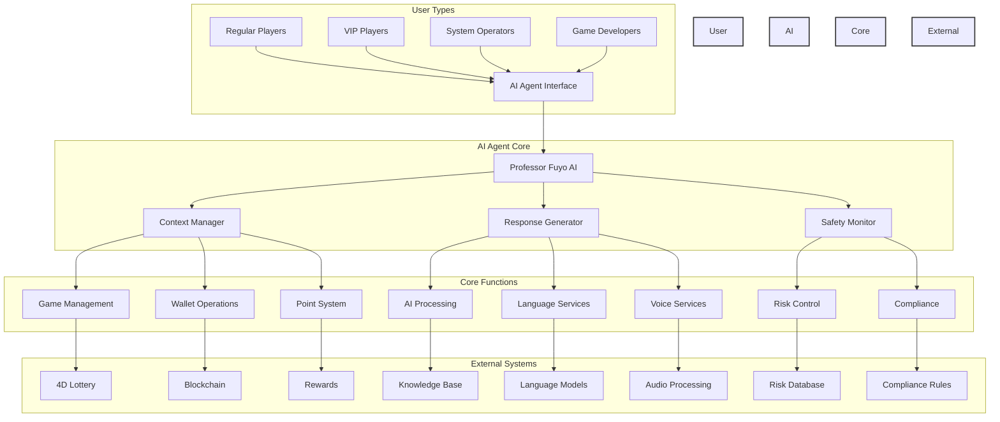
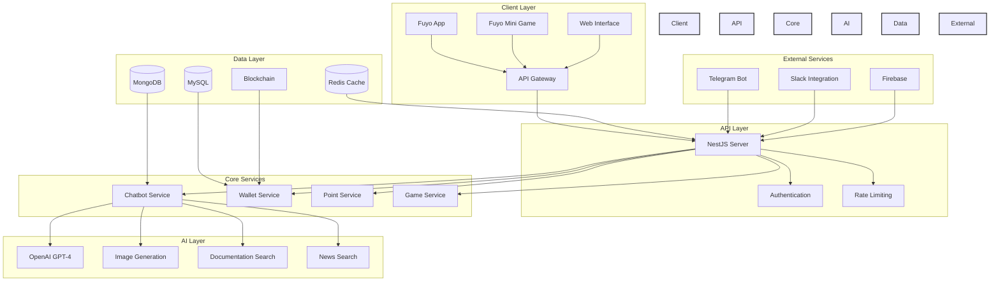

# Fuyo - AI Agent Documentation

## Overview
The Game Core project features an intelligent AI agent named Professor Fuyo, designed to enhance user engagement in the Fuyo app ecosystem. This AI agent is built using OpenAI's GPT-4 model and provides a conversational interface for users to interact with the Fuyo platform, which combines 4D lottery gaming with blockchain technology.

## High-Level System Orchestration

### Core System Functions



### User Types & Access Levels

1. **Regular Players**
   - Primary interaction with AI for:
     - Number recommendations
     - Betting strategies
     - Game explanations
     - Account management
   - Access to basic AI features
   - Standard safety monitoring

2. **VIP Players**
   - Enhanced AI capabilities:
     - Personalized recommendations
     - Advanced betting strategies
     - Priority support
     - Exclusive features
   - Extended context retention
   - Customized risk assessment

3. **System Operators**
   - Administrative access to:
     - AI configuration
     - System monitoring
     - Performance analytics
     - Safety protocols
   - Override capabilities
   - System maintenance

4. **Game Developers**
   - Integration access to:
     - AI API endpoints
     - Protocol documentation
     - Testing environments
     - Development tools
   - Feature implementation
   - Custom integration

### AI Agent Core Functions

1. **Context Manager**
   - Maintains conversation history
   - Tracks user preferences
   - Manages session state
   - Handles multi-protocol context

2. **Response Generator**
   - Natural language processing
   - Multi-language support
   - Voice interaction
   - Contextual responses

3. **Safety Monitor**
   - Risk assessment
   - Compliance checking
   - Fraud detection
   - Responsible gambling

### Core System Functions

1. **Game Management**
   - 4D lottery operations
   - Betting mechanics
   - Game state management
   - Result verification

2. **Wallet Operations**
   - Transaction processing
   - Balance management
   - Security verification
   - Blockchain integration

3. **Point System**
   - Reward calculation
   - Point distribution
   - Redemption rules
   - Loyalty program

4. **AI Processing**
   - GPT-4 integration
   - Context management
   - Response generation
   - Model optimization

5. **Language Services**
   - Translation
   - Language detection
   - Cultural adaptation
   - Regional variations

6. **Voice Services**
   - Text-to-Speech
   - Voice customization
   - Audio processing
   - Quality control

7. **Risk Control**
   - Risk assessment
   - Compliance monitoring
   - Fraud detection
   - Transaction verification

8. **Compliance**
   - Regulatory compliance
   - Safety protocols
   - User protection
   - System monitoring

## Technical Implementation

### System Architecture



### Technical Features

#### System Performance
- **Response Time**: < 200ms for API calls
- **Concurrent Users**: Supports 10,000+ simultaneous connections
- **Uptime**: 99.99% service availability
- **Scalability**: Horizontal scaling with auto-load balancing
- **Cache Hit Rate**: > 90% for frequently accessed data

#### AI Capabilities
- **Language Model**: OpenAI GPT-4 (8K context window)
- **Image Generation**: DALL-E 3 integration
- **Translation**: Real-time across 50+ languages
- **Voice Processing**: 
  - Text-to-Speech: Google Cloud Text-to-Speech
  - Multiple voice options per language
  - Natural prosody and intonation
  - SSML support for custom voice effects
  - 24kHz audio quality

#### Database Performance
- **MongoDB**: 
  - Read Latency: < 10ms
  - Write Latency: < 20ms
  - Sharding: Enabled for horizontal scaling
- **MySQL**:
  - Query Response: < 50ms
  - Connection Pool: 1000+ connections
  - Replication: Master-Slave setup
- **Redis**:
  - Cache Response: < 1ms
  - Memory Usage: < 70% of allocated
  - Persistence: RDB + AOF

#### Security Features
- **DDoS Protection**: 10Gbps mitigation
- **Rate Limiting**: 100 requests per minute per user
- **Encryption**: AES-256 for data at rest
- **SSL/TLS**: TLS 1.3 with perfect forward secrecy
- **Authentication**: JWT with 15-minute expiry

## Quick Start

### Prerequisites
- Node.js environment
- MongoDB database
- OpenAI API key
- Environment variables configured (see env-example)

### Installation
1. Clone the repository
2. Install dependencies:
```bash
npm install
```

3. Configure environment variables:
```bash
cp env-example .env
# Edit .env with your configuration
```

4. Start the application:
```bash
# Development mode
npm run start:dev

# Production mode
npm run start:prod
```

### API Endpoints
The AI agent is accessible through the following endpoints:
- `POST /chatbot/message` - Send messages to Professor Fuyo
- `GET /chatbot/history` - Retrieve conversation history

## License
Copyright © 2024 Fuyo Protocol. All rights reserved.

This project is currently in a public evaluation phase. During this period, the code is publicly accessible for review and assessment purposes. After the evaluation period, the project will transition to a private repository.

Important Notice:
- This codebase is proprietary and confidential
- Unauthorized copying, modification, distribution, or use of this code is strictly prohibited
- Any unauthorized use may result in legal action
- The copyright notice must be included in all copies or substantial portions of the code
- No part of this code may be reproduced, distributed, or transmitted in any form or by any means without prior written permission

For evaluation purposes:
- Review and feedback are welcome during the public phase
- No derivative works or forks are permitted
- The project's final status will be determined after the evaluation process
- All rights to the code and its derivatives remain with Fuyo Protocol
